Disclaimer: All tests were conducted on a single Mac OS machine (Apple Silicon). The load generator (k6) and application containers ran concurrently, causing resource contention. The following results are valid for *relative comparison* only and do not represent absolute, production-level performance.

## Detailed Container Resource Analysis

### Container Resource Limits and Configuration
All containers were configured with identical resource constraints to ensure fair comparison:
- **CPU Limit**: 1.0 core (per container)
- **Memory Limit**: 1GB (per container)
- **Platform**: linux/arm64 (Apple Silicon optimized)
- **Network**: Custom Docker network (`poc-net`)
- **Database Connection**: PostgreSQL container with shared network access

### Container Resource Usage

| Contender | Startup Time (s) | Image Size (MB) | Memory (Idle) |
| :--- | :---: | :---: | :---: |
| Go - Gin | 1 | 34.95 | 3.98 |
| Go - Fiber | 1 | 22.90 | 5.32 |
| Java - Spring JVM | 11 | 334.95 | 357.60 |
| Java - Quarkus Native | 1 | 110.56 | 10.39 |

*Memory values are reported in MiB.*

## Test Results

| Test Type | Metric | Go - Gin | Go - Fiber | Java - Spring JVM | Java - Quarkus Native |
| :--- | :--- | ---: | ---: | ---: | ---: |
| **Realistic Transaction** | Avg. RPS | 1941 | 2466 | 1520 | 1536 |
| (Primary Metric) | p99 Latency (ms) | 163.81 | 95.87 | 188.25 | 182.67 |
|  | Mem (Under Load) | 20.69 | 20.38 | 633.52 | 103.57 |
| **Database I/O (Read)** | Avg. RPS | 5877 | 7512 | 3088 | 4540 |
|  | p99 Latency (ms) | 68.30 | 60.29 | 95.10 | 88.30 |
|  | Mem (Under Load) | 18.83 | 18.49 | 611.33 | 80.89 |
| **JSON Parse** | Avg. RPS | 5513 | 7318 | 4372 | 4189 |
|  | p99 Latency (ms) | 69.62 | 57.89 | 94.00 | 87.62 |
|  | Mem (Under Load) | 14.33 | 13.08 | 582.21 | 97.17 |
| **CPU Work** | Avg. RPS | 2207 | 2556 | 1616 | 486 |
|  | p99 Latency (ms) | 188.29 | 154.76 | 119.40 | 497.64 |
|  | Mem (Under Load) | 16.90 | 15.91 | 588.19 | 75.37 |
| **Plaintext** | Avg. RPS | 12145 | 15110 | 6475 | 6974 |
|  | p99 Latency (ms) | 31.70 | 17.75 | 88.33 | 72.36 |
|  | Mem (Under Load) | 14.18 | 10.50 | 553.04 | 57.80 |

*Under-load memory readings are also reported in MiB.*

### Realistic Transaction

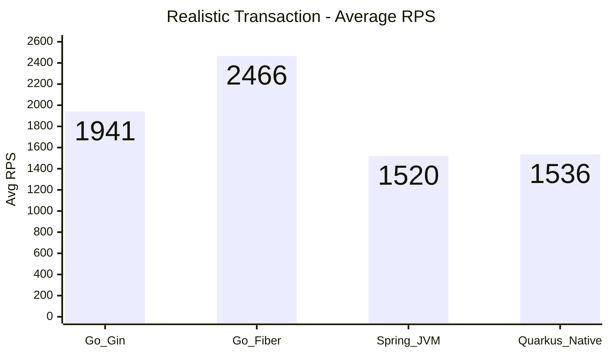

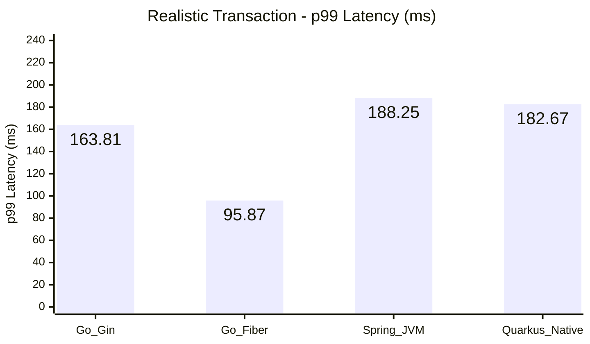

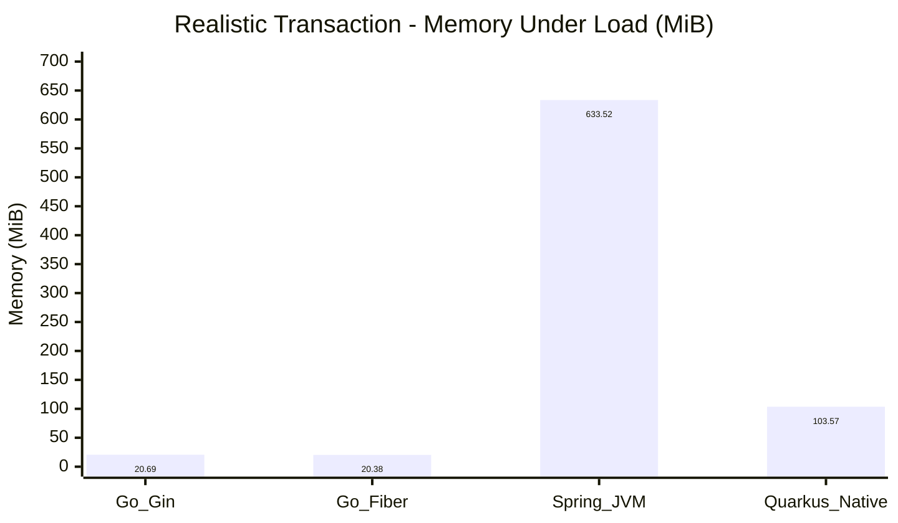

### Database I/O (Read)

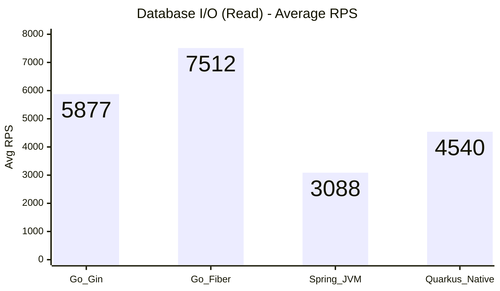

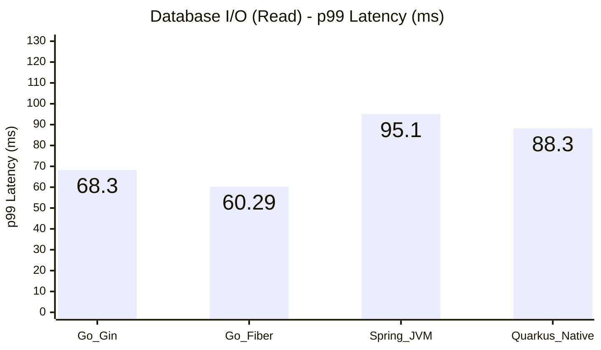

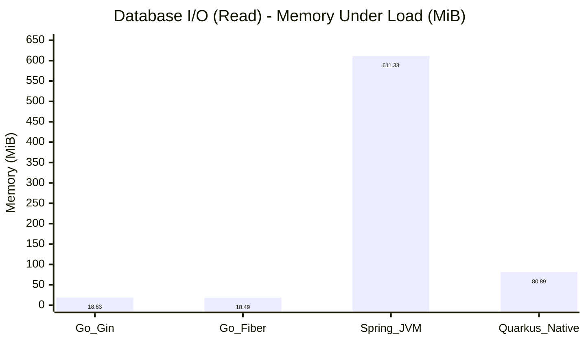

### JSON Parse

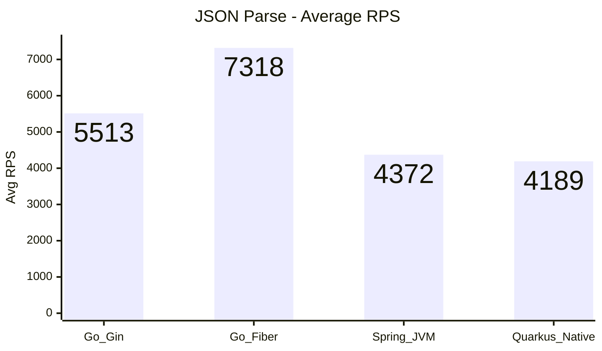

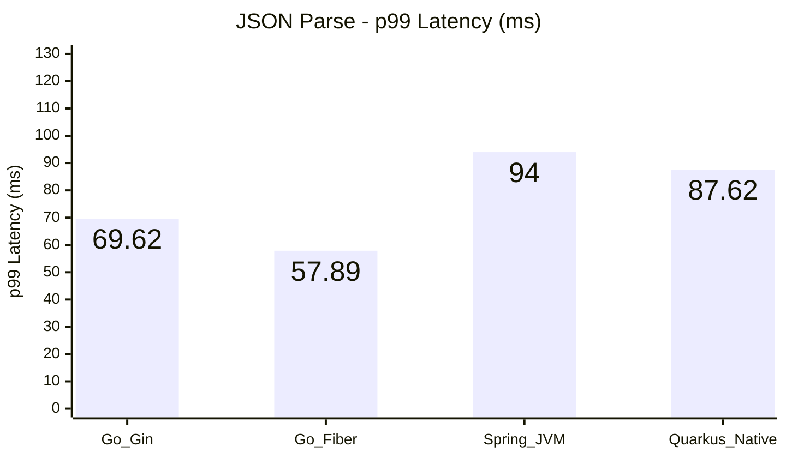

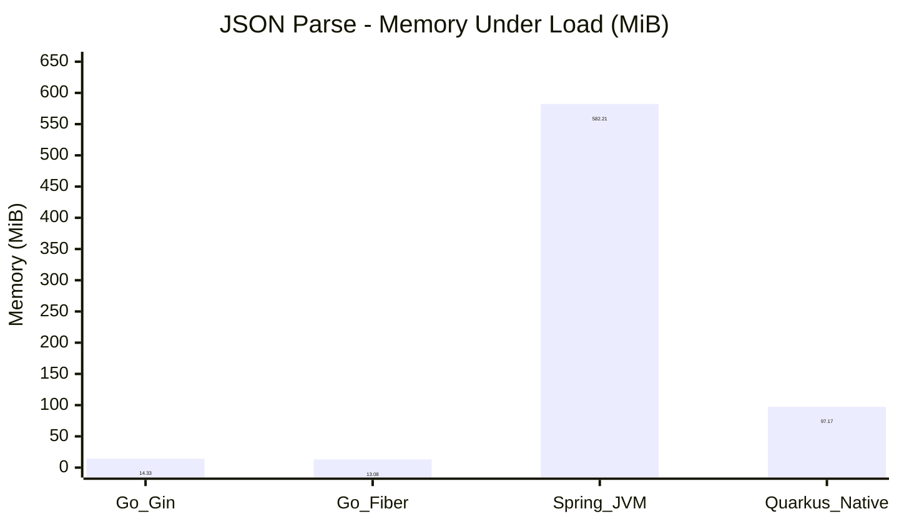

### CPU Work

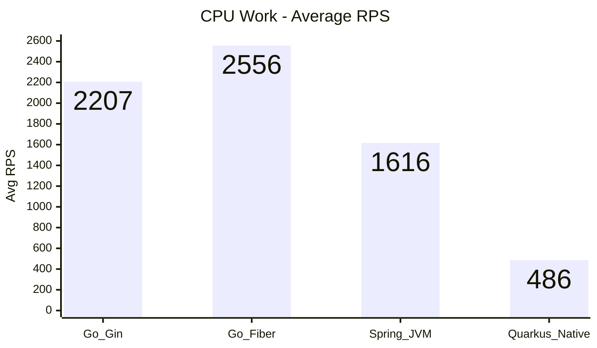

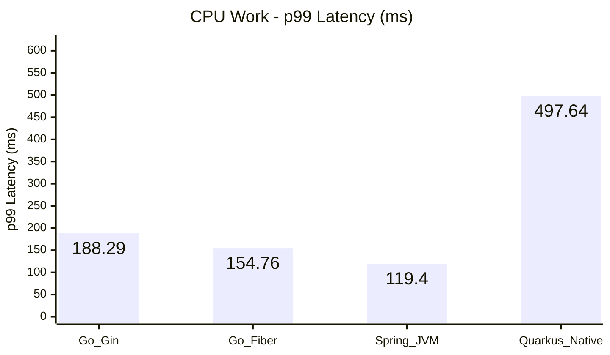

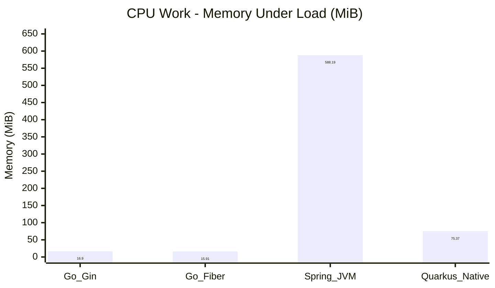

### Plaintext

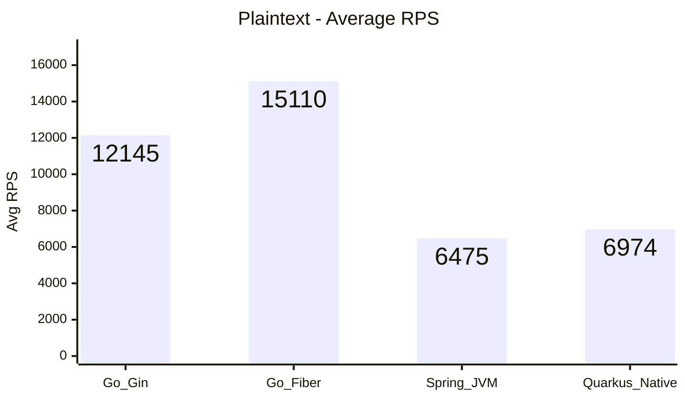

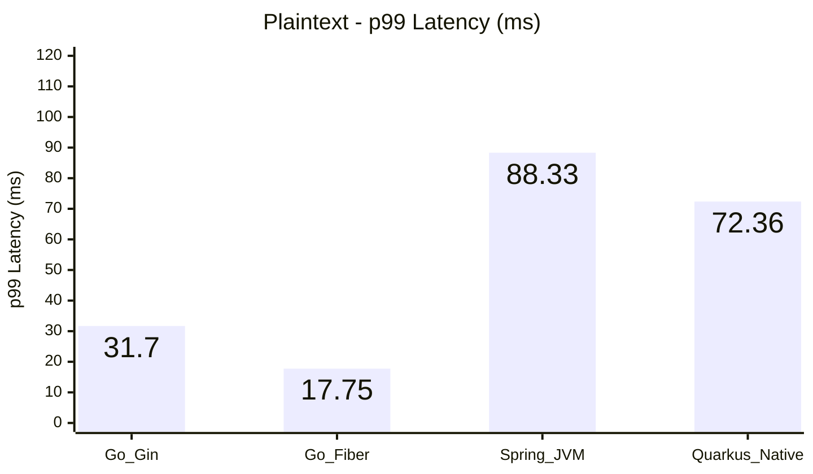

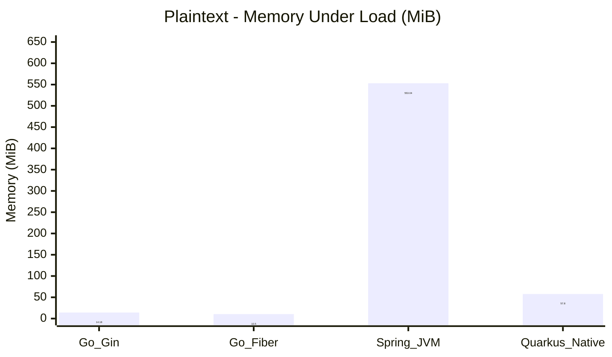

**Framework Selection Guide**
- **Go - Gin**: Choose when startup time and lean memory usage dominate, and you need predictable JSON/plaintext throughput with minimal runtime overhead (cold starts, small services, edge deployments).
- **Go - Fiber**: Prefer when maximum Go throughput and low latency are required, especially for lightweight JSON/DB workloads, while still keeping resource usage modest.
- **Java - Spring JVM**: Use when you rely on Spring ecosystem / JPA maturity and can trade higher memory for rich enterprise features and predictable database performance.
- **Java - Quarkus Native**: Ideal for cloud-native scenarios demanding fast cold starts and minimal idle memory, primarily for mixed workloads where CPU-heavy paths are secondary.

**Analysis & Notes**

- **Go - Gin**
  - Pros: Instant startup with an idle footprint under 4 MiB and steady throughput (~1.9k RPS realistic, 5.9k RPS DB) while keeping JSON/plaintext paths efficient.
  - Cons: Transaction p99 remains ~164 ms—still behind Fiber’s sub-100 ms runs—showing CPU headroom rather than connection settings is the limiter.
- **Go - Fiber**
  - Pros: Maintains the best JSON/DB throughput (~7.3k / 7.5k RPS) and lowest working-set memory (≈10–20 MiB) with realistic load approaching 2.5k RPS.
  - Cons: Even with p99 ≈96 ms, CPU utilization stays pegged near 100%, so further gains require more cores or query tuning.
- **Java - Spring JVM**
  - Pros: Strong database throughput (~3.1k RPS) with moderate p99 (~95 ms) thanks to mature JPA tooling; realistic flow stays near 1.5k RPS.
  - Cons: Startup remains slow (~11 s) and memory footprint is still far higher than Go (≈360 MiB idle / 600 + under load).
- **Java - Quarkus Native**
  - Pros: ≈1 s startup, low idle memory (~10 MiB), and solid DB/JSON throughput (~4.5k/4.2k RPS) with moderate transaction latency.
  - Cons: CPU-bound test still lags (≈0.5k RPS, p99 ≈498 ms) despite moving work off the event loop; native build pipeline adds operational overhead.

**Issue Log & Resolutions**
- **Gin & Fiber (Go)** – Initial `/db` and `/interaction` tests were connection-pool bound (default 2 idle/open connections). Resolved by enabling prepared statements and setting `MaxOpenConns/MaxIdleConns=50` with 5 m/2 m lifetimes.
- **Spring Boot (Java)** – CamelCase payloads (`customerId`) failed JSON binding once snake_case serialization was enabled. Added `@JsonAlias("customerId")` so both casings map to the DTO.
- **Quarkus Native (Java)** – `/cpu` endpoint executed on the event loop thread, limiting concurrency (~300 RPS). Annotated the handler with `@Blocking` to shift heavy hashing to the worker pool, moderately improving throughput while keeping the native profile intact.
