Disclaimer: All tests were conducted on a single Mac OS machine (Apple Silicon). The load generator (k6) and application containers ran concurrently, causing resource contention. The following results are valid for *relative comparison* only and do not represent absolute, production-level performance.

## Detailed Container Resource Analysis

### Container Resource Limits and Configuration
All containers were configured with identical resource constraints to ensure fair comparison:
- **CPU Limit**: 1.0 core (per container)
- **Memory Limit**: 1GB (per container)
- **Platform**: linux/arm64 (Apple Silicon optimized)
- **Network**: Custom Docker network (`poc-net`)
- **Database Connection**: PostgreSQL container with shared network access

### Container Resource Usage

| Contender | Startup Time (s) | Image Size (MB) | Memory (Idle) |
| :--- | :---: | :---: | :---: |
| Go - Gin | &lt;1 | 34.95 | 3.87 |
| Go - Fiber | 1 | 22.90 | 5.36 |
| Java - Spring JVM | 14 | 334.80 | 456.90 |
| Java - Quarkus Native | 1 | 110.56 | 10.39 |

*Memory values are reported in MiB.*

## Test Results

| Test Type | Metric | Go - Gin | Go - Fiber | Java - Spring JVM | Java - Quarkus Native |
| :--- | :--- | ---: | ---: | ---: | ---: |
| **Realistic Transaction** | Avg. RPS | 1590 | 1778 | 976 | 890 |
| (Primary Metric) | p99 Latency (ms) | 164.17 | 154.29 | 227.2 | 203.31 |
|  | Mem (Under Load) | 28.63 | 20.42 | 667.9 | 120.7 |
| **Database I/O (Read)** | Avg. RPS | 5439 | 6956 | 2714 | 3052 |
|  | p99 Latency (ms) | 70.16 | 61.46 | 125.35 | 99.3 |
|  | Mem (Under Load) | 18.07 | 18.15 | 636.5 | 99.08 |
| **JSON Parse** | Avg. RPS | 5661 | 7427 | 4193 | 3411 |
|  | p99 Latency (ms) | 66.49 | 56.36 | 119.58 | 93.16 |
|  | Mem (Under Load) | 14.88 | 14.01 | 622.9 | 105.3 |
| **CPU Work** | Avg. RPS | 1850 | 2021 | 1424 | 386 |
|  | p99 Latency (ms) | 220.33 | 184.76 | 134.11 | 607.78 |
|  | Mem (Under Load) | 17.95 | 17.76 | 624.6 | 73.96 |
| **Plaintext** | Avg. RPS | 13142 | 16704 | 5826 | 6234 |
|  | p99 Latency (ms) | 23.54 | 14.74 | 109.25 | 73.97 |
|  | Mem (Under Load) | 14.10 | 10.23 | 606.1 | 81.5 |

*Under-load memory readings are also reported in MiB.*

### Realistic Transaction

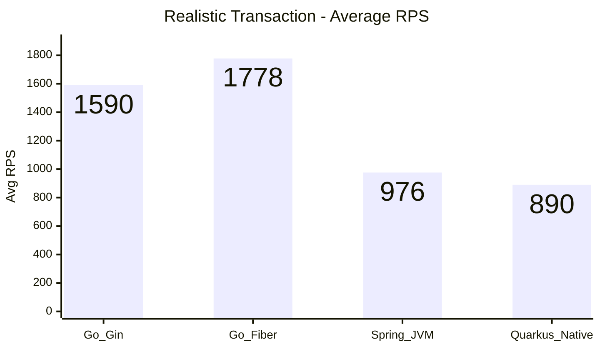

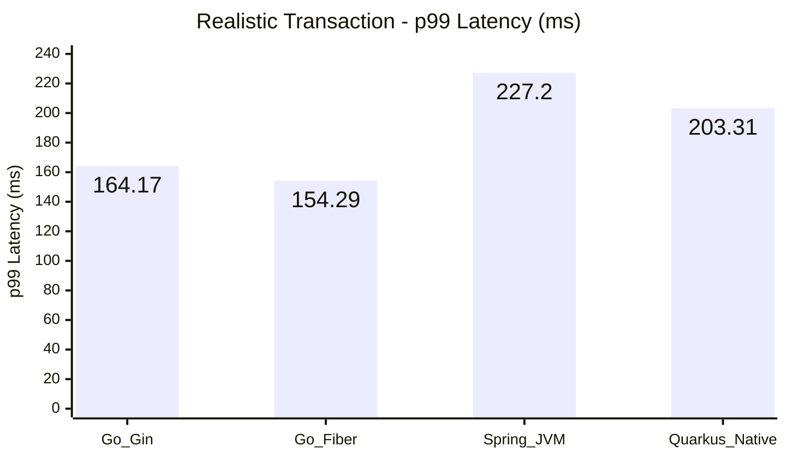

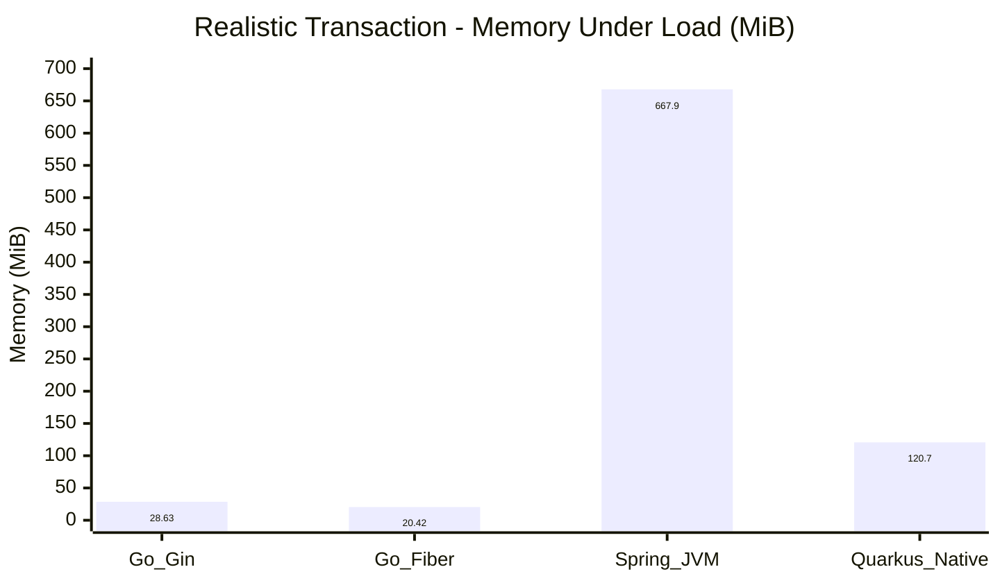

### Database I/O (Read)

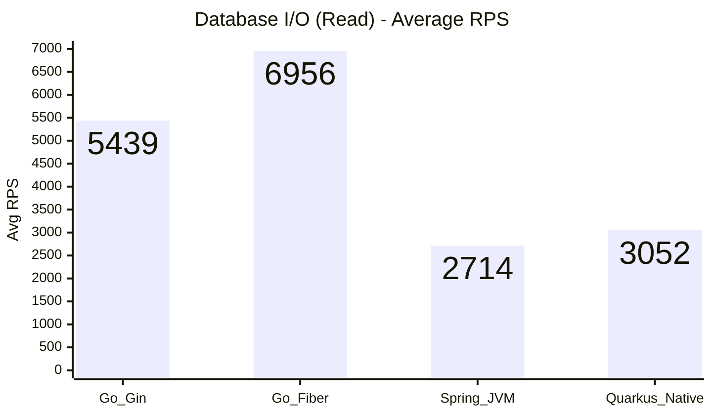

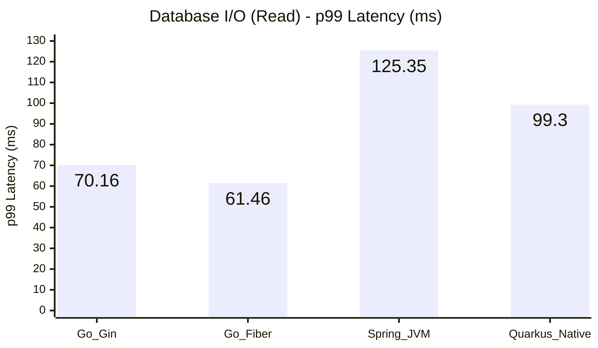

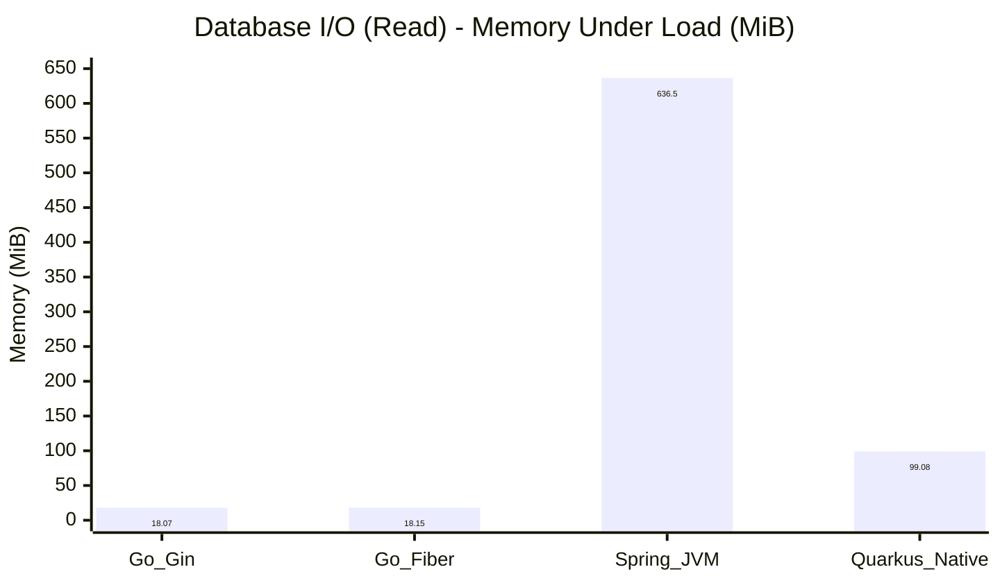

### JSON Parse

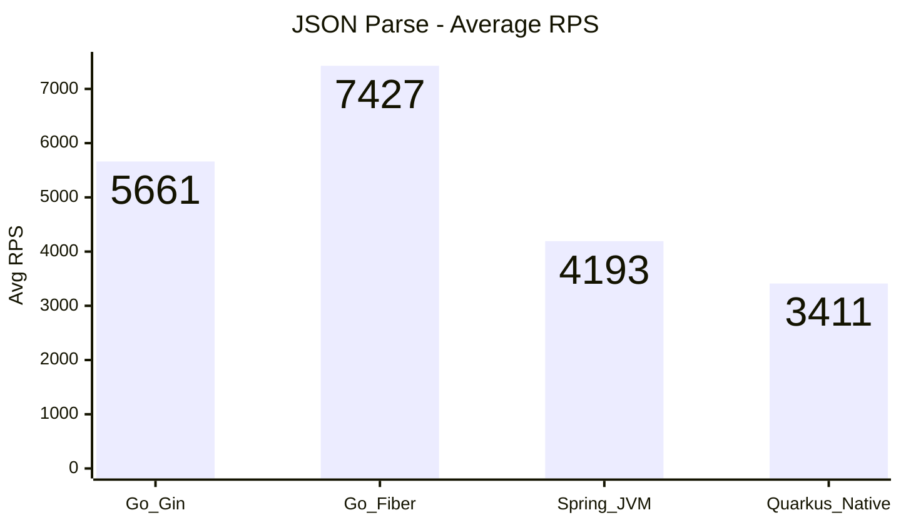

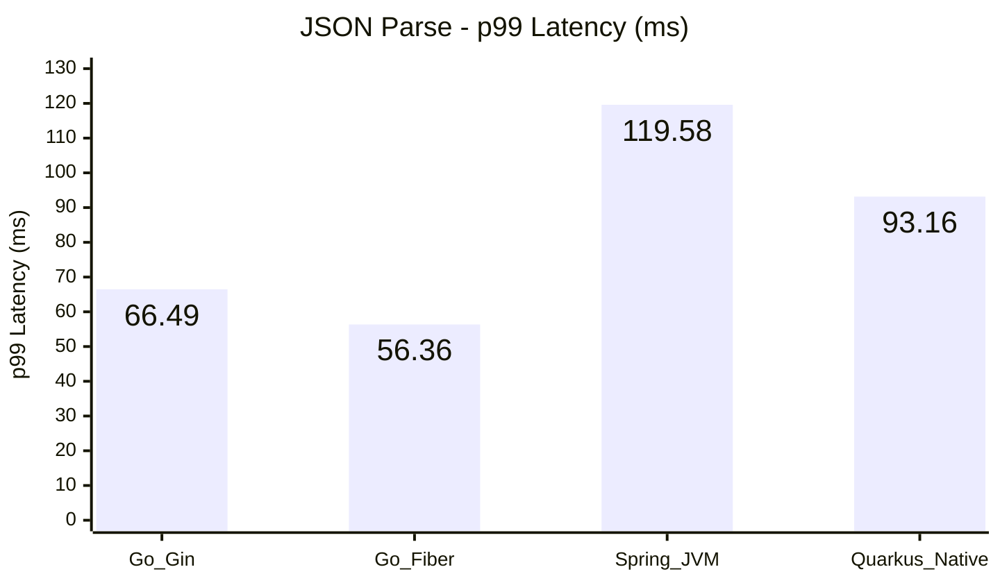

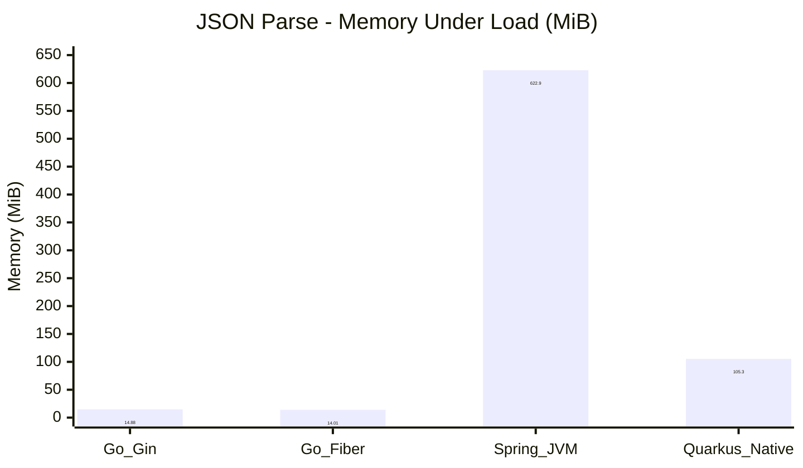

### CPU Work

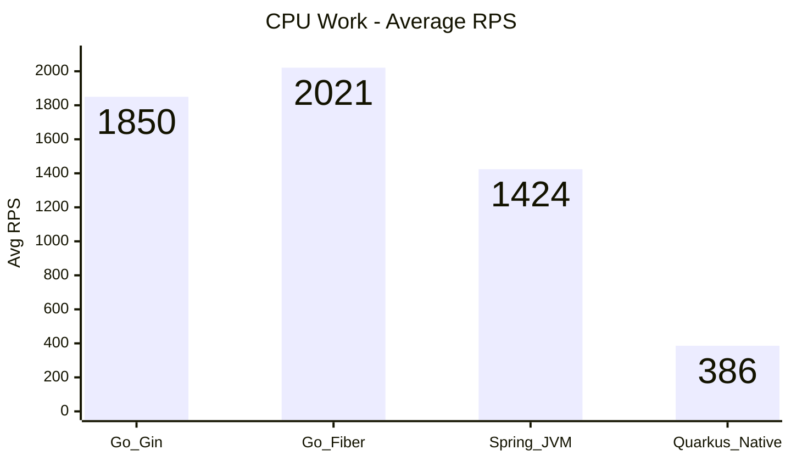

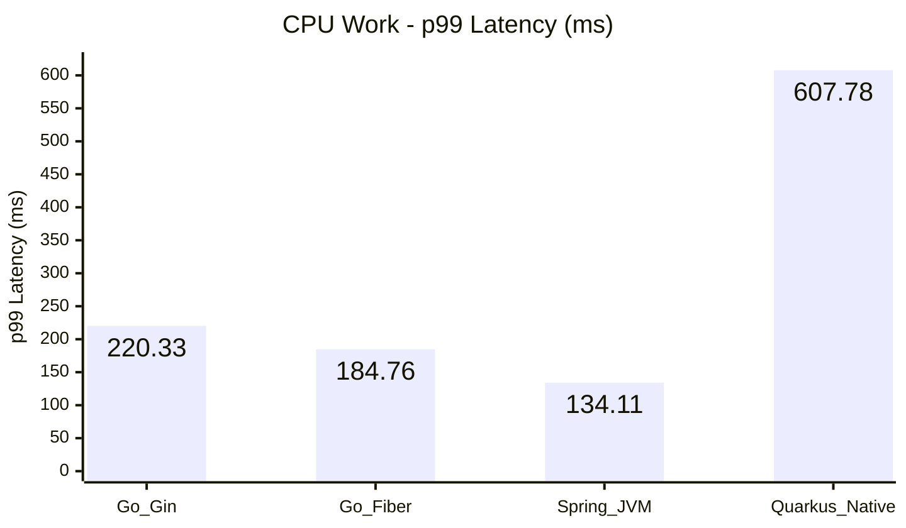

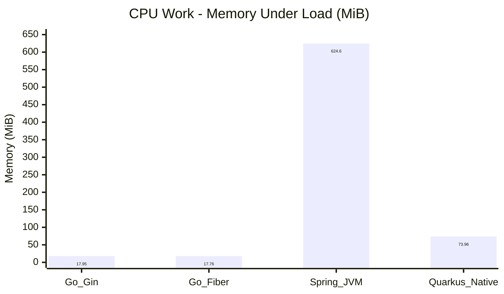

### Plaintext

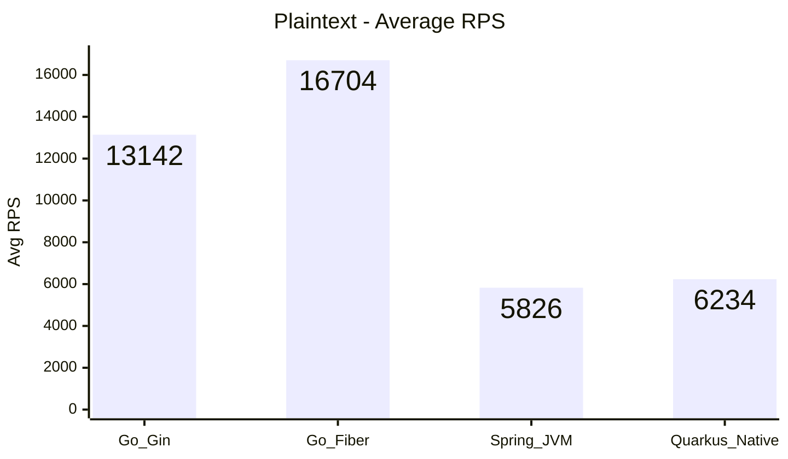

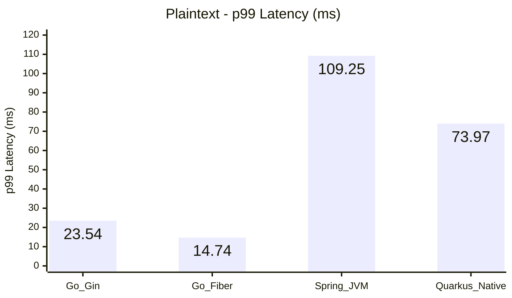

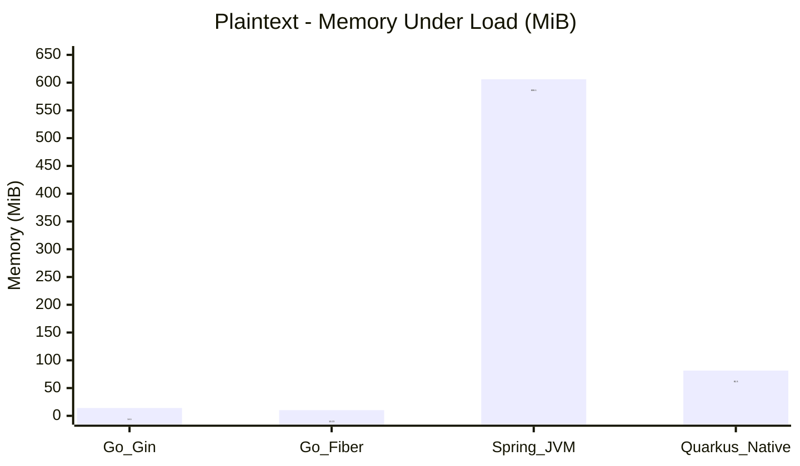

**Framework Selection Guide**
- **Go - Gin**: Choose when startup time and lean memory usage dominate, and you need predictable JSON/plaintext throughput with minimal runtime overhead (cold starts, small services, edge deployments).
- **Go - Fiber**: Prefer when maximum Go throughput and low latency are required, especially for lightweight JSON/DB workloads, while still keeping resource usage modest.
- **Java - Spring JVM**: Use when you rely on Spring ecosystem / JPA maturity and can trade higher memory for rich enterprise features and predictable database performance.
- **Java - Quarkus Native**: Ideal for cloud-native scenarios demanding fast cold starts and minimal idle memory, primarily for mixed workloads where CPU-heavy paths are secondary.

**Analysis & Notes**

- **Go - Gin**
  - Pros: Instant startup with an idle footprint under 4 MiB and steady throughput (~1.6k RPS realistic, 5.4k RPS DB) while keeping JSON/plaintext paths efficient.
  - Cons: Transaction p99 drifted to ~164 ms—still slower than Fiber—indicating CPU headroom rather than connection settings is now the bottleneck.
- **Go - Fiber**
  - Pros: Maintains the best JSON/DB throughput (~7.4k / 7.0k RPS) and lowest working-set memory (≈10–20 MiB) with realistic load near 1.8k RPS.
  - Cons: Transaction latency climbed to ~154 ms and CPU utilization still pegs at 100%, so further gains require more cores or query tuning.
- **Java - Spring JVM**
  - Pros: Strong database throughput (~2.7k RPS) with moderate p99 (~125 ms) thanks to mature JPA tooling; realistic flow stays near 1k RPS.
  - Cons: Startup remains slow (~14 s) and memory footprint is orders of magnitude higher (≈450 MiB idle / 600 + under load).
- **Java - Quarkus Native**
  - Pros: Sub-second startup, low idle memory (~10 MiB), and solid DB/JSON throughput (~3k/3.4k RPS) with moderate transaction latency.
  - Cons: CPU-bound test still lags (≈386 RPS, p99 ≈608 ms) despite moving work off the event loop; native build pipeline adds operational overhead.

**Issue Log & Resolutions**
- **Gin & Fiber (Go)** – Initial `/db` and `/interaction` tests were connection-pool bound (default 2 idle/open connections). Resolved by enabling prepared statements and setting `MaxOpenConns/MaxIdleConns=50` with 5 m/2 m lifetimes.
- **Spring Boot (Java)** – CamelCase payloads (`customerId`) failed JSON binding once snake_case serialization was enabled. Added `@JsonAlias("customerId")` so both casings map to the DTO.
- **Quarkus Native (Java)** – `/cpu` endpoint executed on the event loop thread, limiting concurrency (~300 RPS). Annotated the handler with `@Blocking` to shift heavy hashing to the worker pool, moderately improving throughput while keeping the native profile intact.
