Disclaimer: All tests were conducted on a single Mac OS machine (Apple Silicon). The load generator (k6) and application containers ran concurrently, causing resource contention. The following results are valid for *relative comparison* only and do not represent absolute, production-level performance.

| Contender | Startup Time (s) | Image Size (MB) | Memory (Idle) (MiB) |
| :--- | :---: | :---: | :---: |
| Go - Gin | 1 | 34.95 | 22.32 |
| Go - Fiber | 2 | 22.90 | 17.89 |
| Java - Spring JVM | 17 | 334.80 | 394.40 |
| Java - Quarkus Native | 1 | 110.57 | 10.14 |

| Test Type | Metric | Go - Gin | Go - Fiber | Java - Spring JVM | Java - Quarkus Native | Java - Quarkus JVM |
| :--- | :--- | ---: | ---: | ---: | ---: | ---: |
| Realistic Transaction | Avg RPS | 1706 | 1799 | 976 | 890 | 1475 |
|  | p99 Latency (ms) | 148.88 | 126.3 | 227.2 | 203.31 | 179.14 |
|  | Mem (MiB) | 43.6 | 32.55 | 667.9 | 120.7 | 272.6 |
| Database I/O (Read) | Avg RPS | 5526 | 6980 | 2714 | 3052 | 4613 |
|  | p99 Latency (ms) | 69.25 | 60.15 | 125.35 | 99.3 | 86.73 |
|  | Mem (MiB) | 42.16 | 32.62 | 636.5 | 99.08 | 237.7 |
| JSON Parse | Avg RPS | 5755 | 7911 | 4193 | 3411 | 4524 |
|  | p99 Latency (ms) | 67.77 | 56.02 | 119.58 | 93.16 | 82.27 |
|  | Mem (MiB) | 35.81 | 27.84 | 622.9 | 105.3 | 208.1 |
| CPU Work | Avg RPS | 1927 | 2209 | 1424 | 386 | 1503 |
|  | p99 Latency (ms) | 209.42 | 174.49 | 134.11 | 607.78 | 197.5 |
|  | Mem (MiB) | 39.87 | 32.51 | 624.6 | 73.96 | 219.7 |
| Plaintext | Avg RPS | 14429 | 15952 | 5826 | 6234 | 10702 |
|  | p99 Latency (ms) | 18.98 | 13.67 | 109.25 | 73.97 | 45.84 |
|  | Mem (MiB) | 32.75 | 21.74 | 606.1 | 81.5 | 175.5 |

### Realistic Transaction

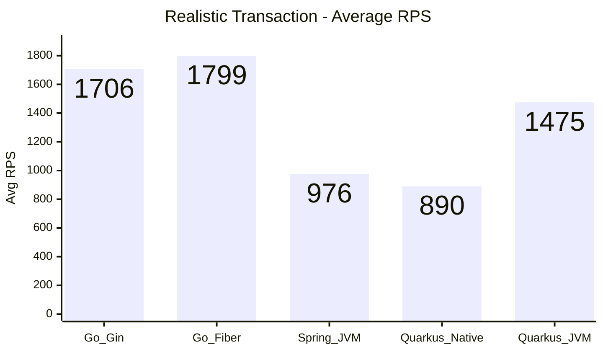

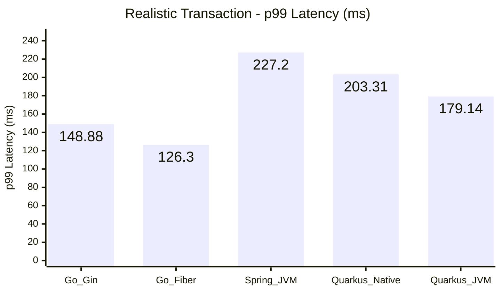

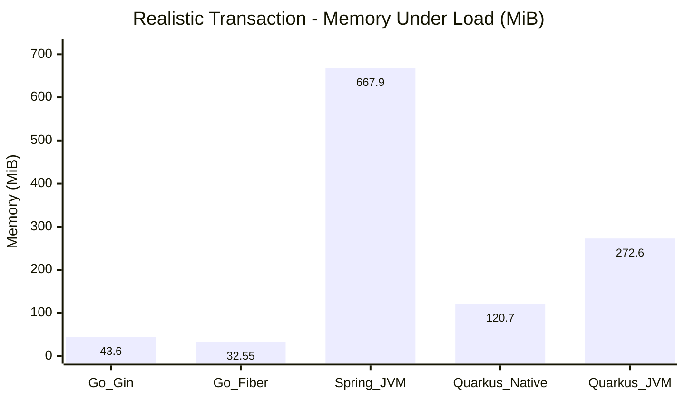

### Database I/O (Read)

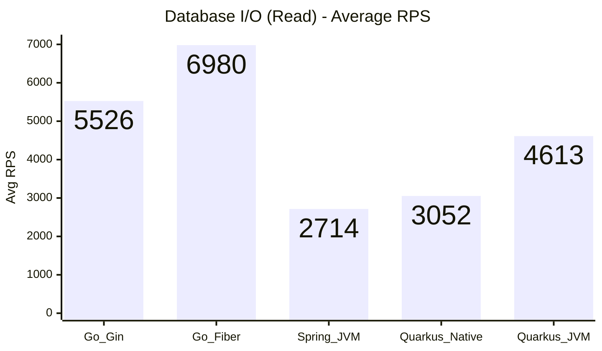

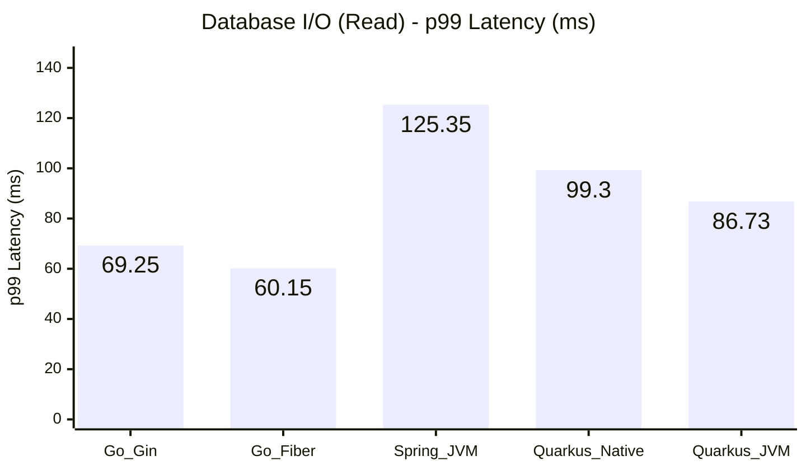

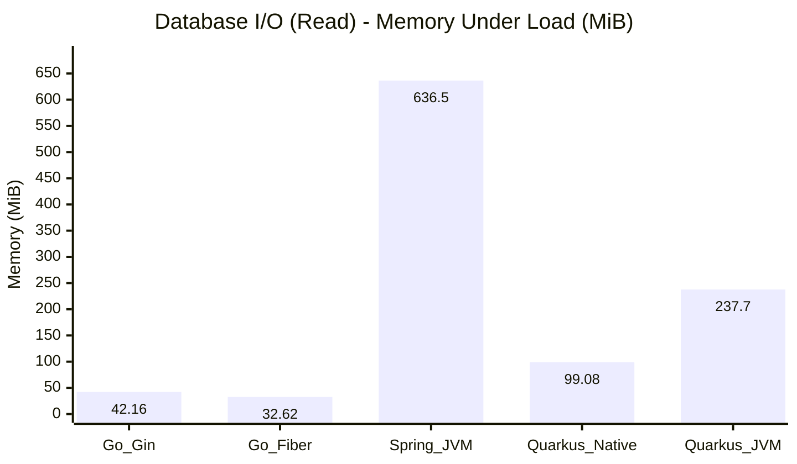

### JSON Parse

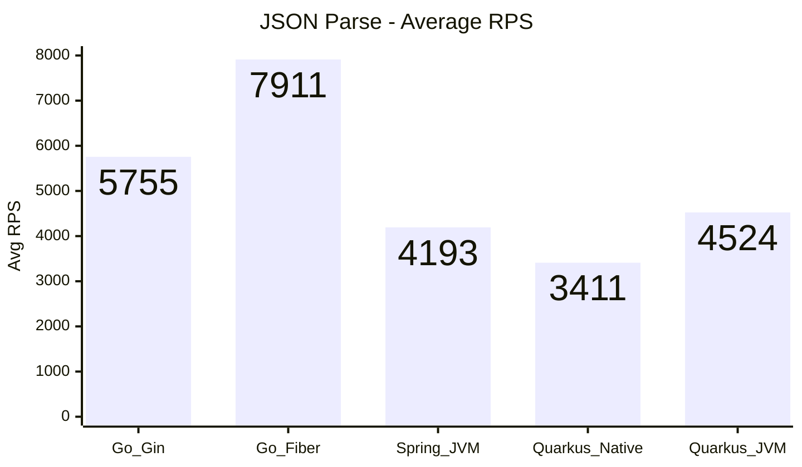

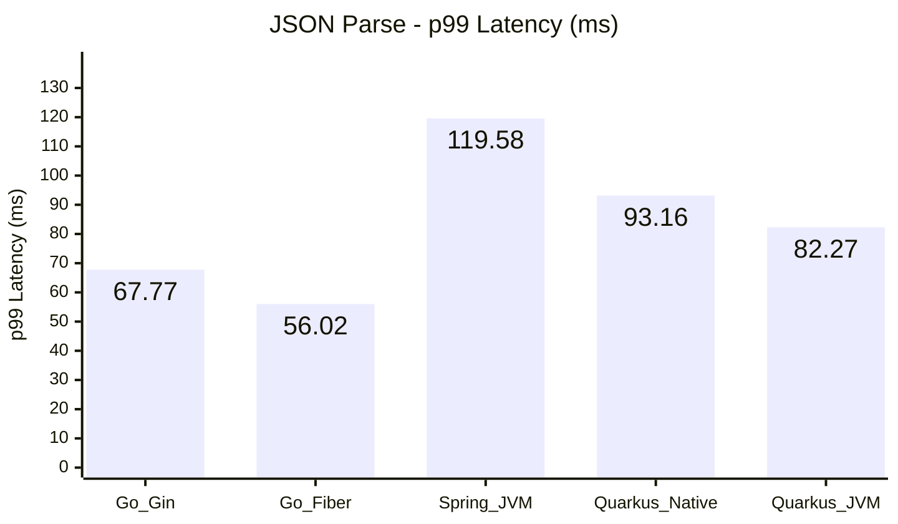

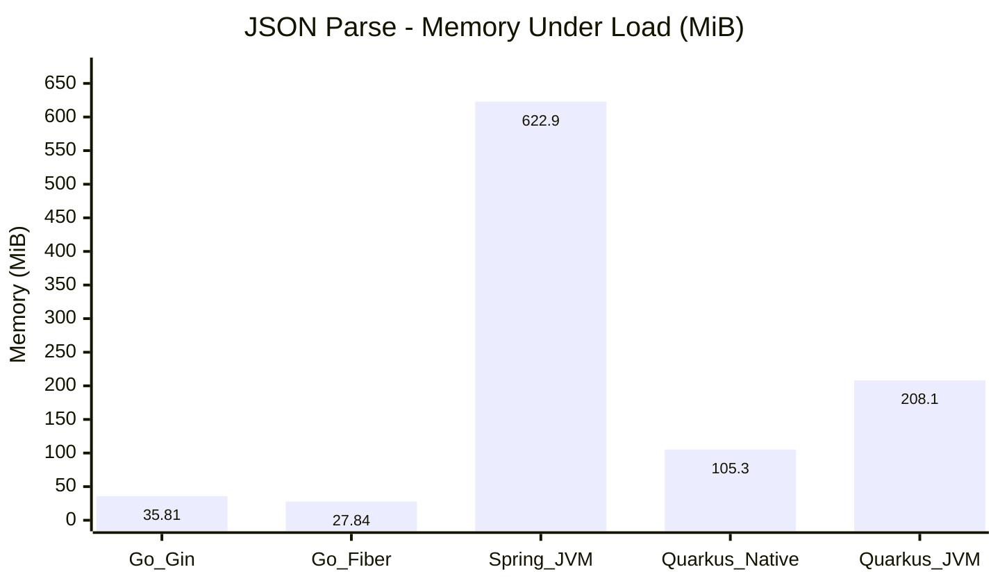

### CPU Work

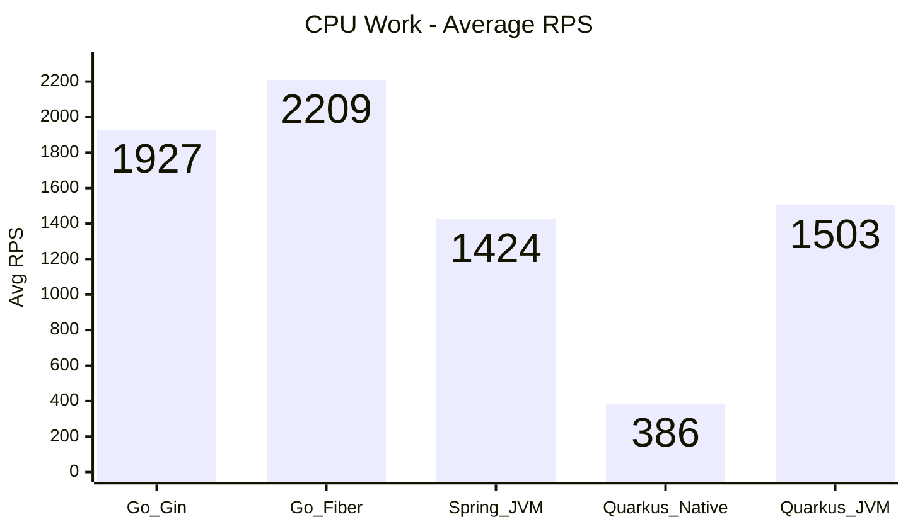

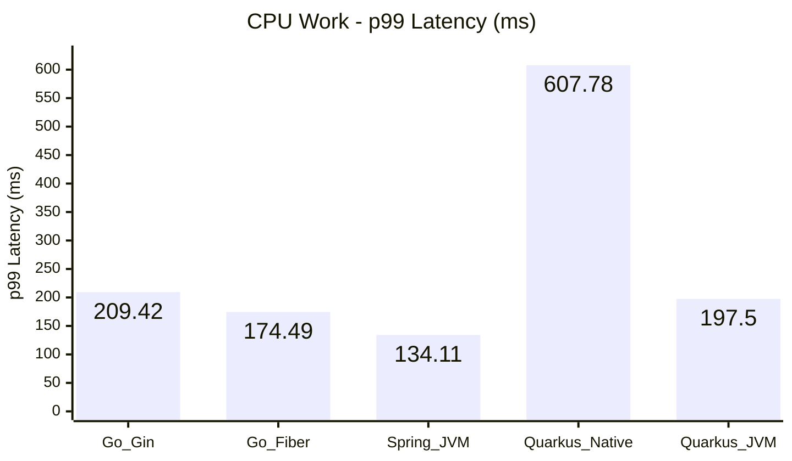

### Plaintext

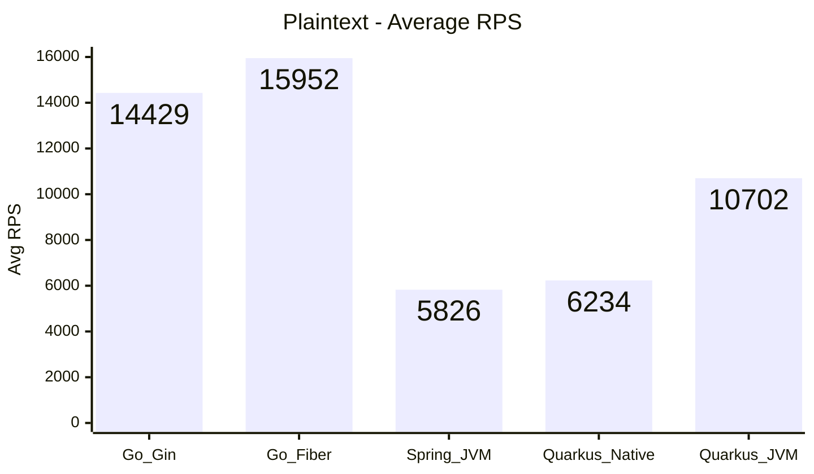

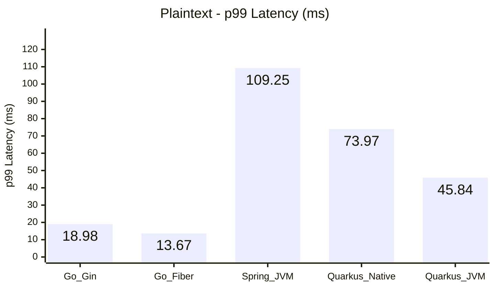

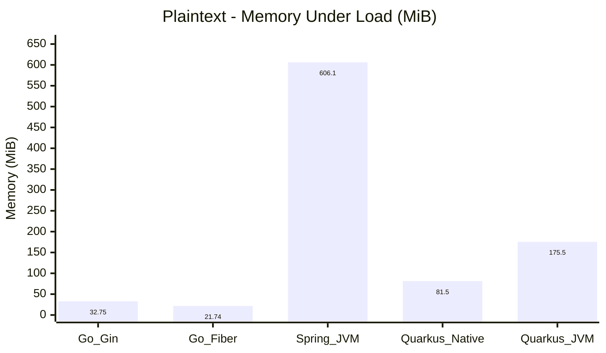

**Framework Selection Guide**
- **Go - Gin**: Choose when startup time and lean memory usage dominate, and you need predictable JSON/plaintext throughput with minimal runtime overhead (cold starts, small services, edge deployments).
- **Go - Fiber**: Prefer when maximum Go throughput and low latency are required, especially for lightweight JSON/DB workloads, while still keeping resource usage modest.
- **Java - Spring JVM**: Use when you rely on Spring ecosystem / JPA maturity and can trade higher memory for rich enterprise features and predictable database performance.
- **Java - Quarkus Native**: Ideal for cloud-native scenarios demanding fast cold starts and minimal idle memory, primarily for mixed workloads where CPU-heavy paths are secondary.
- **Java - Quarkus JVM**: Consider when CPU-bound throughput and JVM tooling outweigh the costs of larger images and higher idle memory—essentially when JIT benefits are critical.

**Analysis & Notes**

- **Go - Gin**
  - Pros: Instant startup, minimal idle footprint (~22 MiB), and competitive throughput (≈1.7k RPS realistic, 5.5k RPS DB) with stable JSON/plaintext numbers.
  - Cons: Transaction p99 remains ~150 ms—slower than Fiber—suggesting additional tuning (prepared statements already enabled) or more CPU headroom may be needed.
- **Go - Fiber**
  - Pros: Leads overall RPS and latency in plaintext/JSON/DB tests; realistic workload tops ~1.8k RPS with p99 ≈126 ms while keeping memory under load below Gin.
  - Cons: CPU saturation still hits 100%; benefits from additional cores or DB-side optimizations for heavier transactions.
- **Java - Spring JVM**
  - Pros: Strong database throughput (~2.7k RPS) with moderate p99 (~125 ms) thanks to mature JPA tooling; realistic flow stays near 1k RPS.
  - Cons: Startup remains slow (17 s) and memory footprint is orders of magnitude higher (≈400 MiB idle / 600 + under load).
- **Java - Quarkus Native**
  - Pros: Sub-second startup, low idle memory (~10 MiB), and solid DB/JSON throughput (~3k/3.4k RPS) with moderate transaction latency.
  - Cons: CPU-bound test still lags (≈386 RPS, p99 ≈608 ms) despite moving work off the event loop; native build pipeline adds operational overhead.

**Issue Log & Resolutions**
- **Gin & Fiber (Go)** – Initial `/db` and `/interaction` tests were connection-pool bound (default 2 idle/open connections). Resolved by enabling prepared statements and setting `MaxOpenConns/MaxIdleConns=50` with 5 m/2 m lifetimes.
- **Spring Boot (Java)** – CamelCase payloads (`customerId`) failed JSON binding once snake_case serialization was enabled. Added `@JsonAlias("customerId")` so both casings map to the DTO.
- **Quarkus Native (Java)** – `/cpu` endpoint executed on the event loop thread, limiting concurrency (~300 RPS). Annotated the handler with `@Blocking` to shift heavy hashing to the worker pool, moderately improving throughput while keeping the native profile intact.
